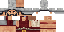

# 💁‍♀️ NPC Skins

| Skin | Dateiname |
| ------- | -------- |
|  | mobs_igor.png |
|  | mobs_igor2.png |
|  | mobs_igor3.png |
|  | mobs_igor4.png |
|  | mobs_igor5.png |
|  | mobs_igor6.png |
|  | mobs_igor7.png |
|  | mobs_igor8.png |
|  | mobs_npc.png |
|  | mobs_npc2.png |
|  | mobs_npc3.png |
|  | mobs_npc4.png |
|  | mobs_npc5.png |
|  | mobs_npc6.png |
|  | mobs_npc_baby.png |
|  | mobs_npc_roman_10_4.png |
|  | mobs_npc_roman_15_1.png |
|  | mobs_npc_roman_15_4.png |
|  | mobs_npc_roman_16_3.png |
|  | mobs_npc_roman_17_3.png |
|  | mobs_npc_roman_17_4.png |
|  | mobs_npc_roman_18_2.png |
|  | mobs_npc_roman_18_4.png |
|  | mobs_npc_roman_1_1.png |
|  | mobs_npc_roman_1_3.png |
|  | mobs_npc_roman_23_2.png |
|  | mobs_npc_roman_34_4.png |
|  | mobs_npc_roman_35_1.png |
|  | mobs_npc_roman_35_2.png |
|  | mobs_npc_roman_36_3.png |
|  | mobs_npc_roman_36_4.png |
|  | mobs_npc_roman_37_2.png |
|  | mobs_npc_roman_37_3.png |
|  | mobs_npc_roman_39_3.png |
|  | mobs_npc_roman_3_1.png |
|  | mobs_npc_roman_40_3.png |
|  | mobs_npc_roman_42_1.png |
|  | mobs_npc_roman_44_2.png |
|  | mobs_npc_roman_45_1.png |
|  | mobs_npc_roman_45_2.png |
|  | mobs_npc_roman_47_1.png |
|  | mobs_npc_roman_47_2.png |
|  | mobs_npc_roman_48_2.png |
|  | mobs_npc_roman_48_4.png |
|  | mobs_npc_roman_4_1.png |
|  | mobs_npc_roman_4_3.png |
|  | mobs_npc_roman_5_3.png |
|  | mobs_npc_roman_9_1.png |
|  | mobs_npc_roman_9_2.png |
|  | mobs_trader.png |
|  | mobs_trader2.png |
|  | mobs_trader3.png |
|  | mobs_trader4.png |
